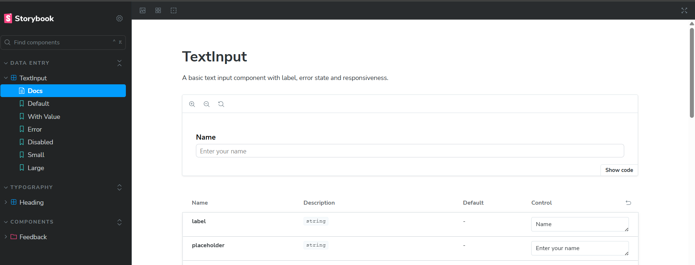

# 🧩 Design System Components

A scalable and reusable design system built using **React**, **TypeScript**, **TailwindCSS**, and **Storybook**. This system includes core UI components like typography, feedback (toasts), and data entry elements with complete accessibility and customization support.

---

## 🚀 Tech Stack

- ⚛️ **React** – Component-based UI
- 🔷 **TypeScript** – Static typing
- 🎨 **TailwindCSS** – Utility-first styling
- 📚 **Storybook** – Interactive documentation
- ⚡ **Vite** – Fast dev environment
- ▲ **Vercel** – Seamless deployment

---

## 📦 Components

### ✅ Typography
- `Heading`: H1 to H6 variants with responsive styles

### ✅ Feedback
- `Toast`: Success, error, warning, info with dismiss

### 🔧 Data Entry *(WIP)*
- Input fields, checkboxes, and more coming soon...

---

## 📸 Storybook

Explore all components interactively via Storybook.


🌍 Live Demo
🔗 [View Storybook](https://design-system-components-zeta.vercel.app/)

## 📸 Screenshots


```bash
npm run storybook

